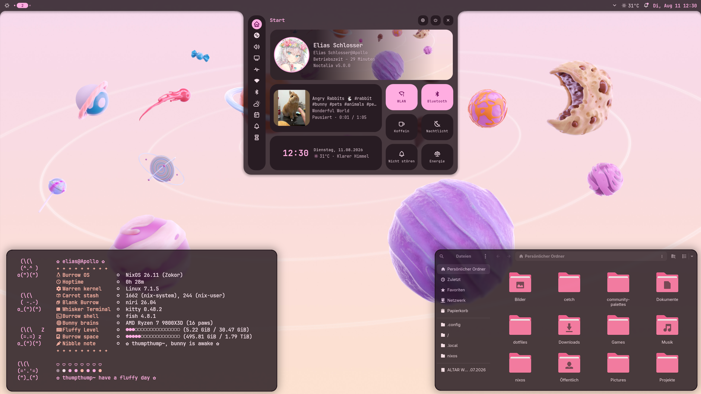
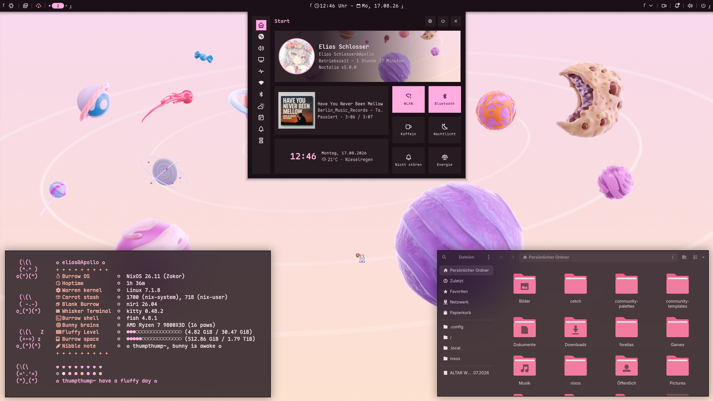
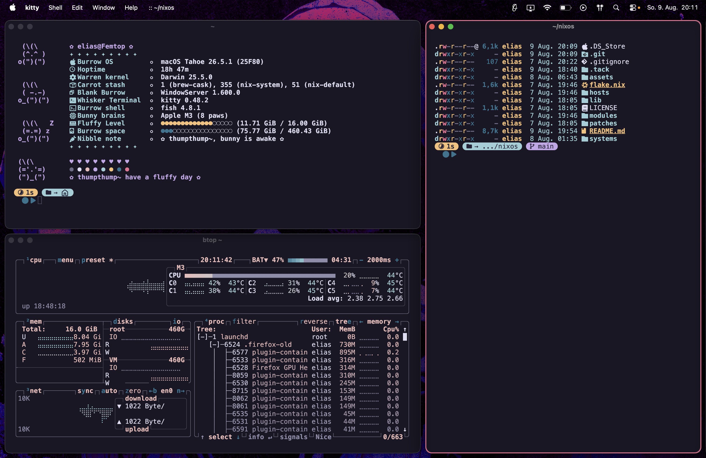

# ❄️ nixos

**My personal NixOS/Nix-Darwin setup with support for multiple hosts.**

Application dotfiles (niri, noctalia, fastfetch, kitty) are managed
declaratively using home-manager.

<div align="center">

## ❄️ NixOS · Niri · Noctalia

**The NNN stack**, running on `wc` and my main setup.

 

## 🍏 Nix-Darwin

**MacOS running OmniWM and Nix-Darwin, my university and productivity setup.**



</div>

---

## 🖥️ Hosts

3 build the same machine, **`Apollo`**, with a different desktop and user bolted
on top:

|  Host   |   User    | Desktop  |                Purpose                 |
| :-----: | :-------: | :------: | :------------------------------------: |
|  `wc`   |  `elias`  |   Niri   |              Daily driver              |
|  `kde`  | `kdelias` | Plasma 6 | For when I want a customizable desktop |
| `gnome` | `gelias`  |  GNOME   |  For when I want a good desktop OOTB   |

And 1 builds on my MacBook Pro, **`Mac`**, with MacOS running OmniWM:

| Host  |  User   | Desktop |              Purpose               |
| :---: | :-----: | :-----: | :--------------------------------: |
| `mac` | `elias` | OmniWM  | Productivity device for University |

```bash
nh os switch .#wc      # niri
nh os switch .#kde     # plasma
nh os switch .#gnome   # gnome
:-------------------------------:
nh darwin switch .#mac # macos
```

---

## 🗂️ Layout

<details>
<summary><b>The whole tree</b> (click to expand)</summary>

```
.
├── hosts
│   ├── gnome
│   │   ├── default.nix
│   │   ├── modules.nix
│   │   └── pkgs.nix
│   ├── kde
│   │   ├── default.nix
│   │   ├── modules.nix
│   │   └── pkgs.nix
│   ├── mac
│   │   ├── default.nix
│   │   ├── modules.nix
│   │   └── pkgs.nix
│   └── wc
│       ├── default.nix
│       ├── modules.nix
│       └── pkgs.nix
├── lib
│   ├── import-tree.nix
│   └── mk-user.nix
├── modules
│   ├── home-manager
│   │   ├── common
│   │   │   ├── _files
│   │   │   │   ├── btop
│   │   │   │   │   └── themes
│   │   │   │   │       └── rose-pine.theme
│   │   │   │   ├── fastfetch
│   │   │   │   │   ├── other-configs
│   │   │   │   │   │   ├── bunnyfetch
│   │   │   │   │   │   │   └── bunnyascii.txt
│   │   │   │   │   │   ├── frieren
│   │   │   │   │   │   │   └── frieren.png
│   │   │   │   │   │   └── kitty
│   │   │   │   │   │       └── cat.txt
│   │   │   │   │   └── nitch.txt
│   │   │   │   └── kitty
│   │   │   │       └── themes
│   │   │   │           ├── one-dark.conf
│   │   │   │           └── rose-pine.conf
│   │   │   ├── btop.nix
│   │   │   ├── cava.nix
│   │   │   ├── default.nix
│   │   │   ├── direnv.nix
│   │   │   ├── fastfetch.nix
│   │   │   ├── fish.nix
│   │   │   ├── git.nix
│   │   │   ├── kitty.nix
│   │   │   ├── nvf.nix
│   │   │   ├── rmpc.nix
│   │   │   ├── starship.nix
│   │   │   └── zed.nix
│   │   ├── darwin
│   │   │   ├── default.nix
│   │   │   ├── man.nix
│   │   │   ├── nh.nix
│   │   │   ├── omniwm.nix
│   │   │   └── tack.nix
│   │   └── nixos
│   │       ├── _files
│   │       │   ├── hypr
│   │       │   │   └── hyprland.lua
│   │       │   └── niri
│   │       │       └── config.kdl
│   │       ├── cursor.nix
│   │       ├── default.nix
│   │       ├── gtk.nix
│   │       ├── hyprland.nix
│   │       ├── mangohud.nix
│   │       ├── niri.nix
│   │       ├── noctalia.nix
│   │       ├── qt.nix
│   │       └── xdg.nix
│   └── system
│       ├── common
│       │   ├── programs
│       │   │   ├── common-pkgs.nix
│       │   │   └── fish.nix
│       │   ├── system
│       │   │   ├── fonts.nix
│       │   │   └── nix.nix
│       │   └── default.nix
│       ├── darwin
│       │   ├── programs
│       │   │   ├── desktop-pkgs.nix
│       │   │   ├── omniwm.nix
│       │   │   ├── steam.nix
│       │   │   └── zen.nix
│       │   ├── system
│       │   │   ├── homebrew.nix
│       │   │   └── touchid.nix
│       │   └── default.nix
│       └── nixos
│           ├── programs
│           │   ├── dconf.nix
│           │   ├── desktop-pkgs.nix
│           │   ├── gamescope.nix
│           │   ├── gpu-screen-recorder.nix
│           │   ├── nh.nix
│           │   ├── nix-ld.nix
│           │   ├── obs-studio.nix
│           │   ├── steam.nix
│           │   ├── tack.nix
│           │   └── zen.nix
│           ├── system
│           │   ├── desktops
│           │   │   ├── gnome.nix
│           │   │   ├── hyprland.nix
│           │   │   ├── niri.nix
│           │   │   ├── plasma6.nix
│           │   │   └── sddm.nix
│           │   ├── amdgpu.nix
│           │   ├── boot.nix
│           │   ├── environment.nix
│           │   ├── hardware.nix
│           │   ├── locale.nix
│           │   ├── openrgb.nix
│           │   ├── openssh.nix
│           │   ├── polkit.nix
│           │   ├── time.nix
│           │   ├── udev.nix
│           │   └── xkb.nix
│           ├── default.nix
│           └── options.nix
├── overlays
│   ├── default.nix
│   ├── options.nix
│   ├── qt6ct-kde.nix
│   └── swash.nix
├── patches
│   ├── qt6ct-shenanigans.patch
│   └── zed-corners.patch
├── systems
│   ├── Apollo
│   │   ├── default.nix
│   │   ├── hardware-configuration.nix
│   │   ├── modules.nix
│   │   └── networking.nix
│   └── Mac
│       ├── default.nix
│       └── modules.nix
├── .tack
│   ├── default.nix
│   ├── pins.lock.json
│   └── pins.toml
└── flake.nix
```

</details>

**short:**

|       Directory        |                    What lives there                     |
| :--------------------: | :-----------------------------------------------------: |
|        `hosts/`        | Per-desktop entry points, which modules, which packages |
|       `systems/`       | Per-machine hardware, networking, machine-wide toggles  |
|       `modules/`       |       The actual configuration, split by platform       |
| `modules/home-manager` |   The actual home-manager modules, split by platform    |
|         `lib/`         |   `import-tree` and `mk-user`, two helpful libraries    |
|        `.tack/`        |   Input pins, the real lockfile replacing flake.lock    |

---

## 📐 Conventions

### The platforms are split

`modules/system/common` is imported by both `nixosSystem` and `darwinSystem`,
`modules/system/nixos` and `modules/system/darwin` only by their own.
`modules/home-manager` holds the respective home-manager modules.

### Options

Modules are toggled through a single option namespace, declared in the module's
.nix file, `modules/common/...` for the shared modules, `modules/nixos/...` for
the Linux-only ones, `modules/darwin/...` for the Darwin-only ones,
`modules/home-manager/nixos/...` for the Linux-only home-manager modules,
`modules/home-manager/darwin/...` for Darwin-only home-manager modules,
`modules/home-manager/common/...` for the shared home-manager modules:

```nix
# example
myModules = {
  desktop = "niri";
  system.overlays.enable = true;
  programs.gpu-screen-recorder.enable = true;
};
home-manager.users.${config.myModules.user}.myModules.home-manager.programs.kitty.enable = true;
```

Every modules is a lib.mkIf statement, therefore to use a module importing it is
not enough, it would also have to be enabled. for options see the respective
options.nix file.

### Adding a module

`lib/import-tree.nix` imports each directory recursively, skipping `default.nix`
and any file prefixed with `_`. So a new module is:

1. a new file, and
2. its option declaration inside the file.

### Users

`lib/mk-user.nix` produces both the system account and the home-manager config
from a name and a host.

### Inputs

Pinned with [**tack**](https://github.com/manic-systems/tack), so
`.tack/pins.toml` is the source of truth and `nix flake update` does nothing.
`tack update` refreshes the lock/inputs.

---

## 🧪 Using it

> [!WARNING]
> This is tailored to my hardware. Simply copying it won't be enough.

Before the first switch you'd need to:

- Replace `systems/Apollo/hardware-configuration.nix`
- Review `systems/Apollo/modules.nix` and/or `systems/Mac/modules.nix`
- Set your own name and email in `modules/home-manager/common-programs/git.nix`
- Place hashed password files at `/etc/nixos/secrets/<user>.txt`

---

## 💜 Credits

Big thanks to the people in the **#nixos** channel of the
[**Noctalia Discord**](https://github.com/noctalia-dev/noctalia-shell), some
honorable mentions:

- [_onoruu_](https://onoruu.neocities.org/)
- [_Stella_](https://github.com/iStellanova/stellyrland)
- [_Stalkingwolf_](https://github.com/Stalkingwolf23-glitch/nixos-dotfiles)
- [_Aria_](https://codeberg.org/princearia/nixos)
- [_sam_](https://github.com/samiser/nix-configs)
- [_Pengo_](https://forge.pengo.uk/pengo/nixos)
- [_LucasOe_](https://github.com/LucasOe/nixos-config)
- [_Hand7s_](https://github.com/s0me1newithhand7s/reNixos)
- [_dish_](https://git.vulpe.systems/vulpe-systems/nix)

---

## 📄 License

[MIT](LICENSE).
